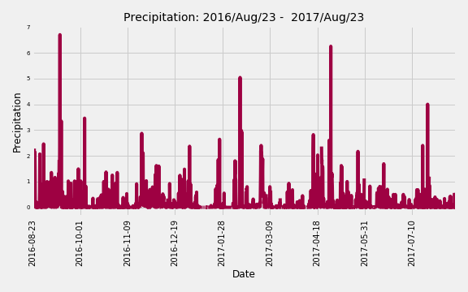
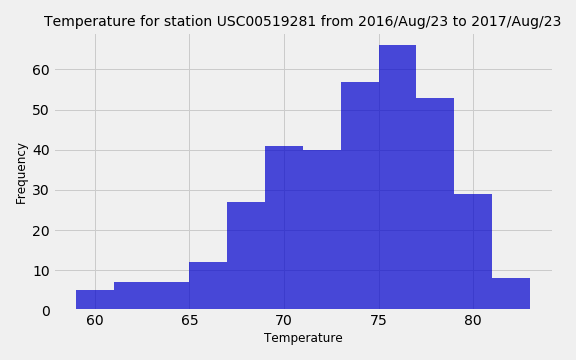
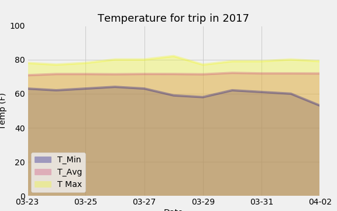

# Surfs Up! - SQLAlchemy ORM, Python, Matplotlib and Flask

This repositorie shows climate analysis and data exploration from two databases.
The data was loaded into the jupyter notebook using SQLAlchemy and the app with Flask.

# The analysis was from 2016-08-23 to 2017-08-23.

## Climate Analysis and Exploration

### Precipitation Analysis

Hawaii had up to 7 inches of rain during the analyzed period. Months with more than 3 inches of rain include: September, October, February, April, and July.

### Station Analysis

The total number of stations are 9, and the analysis showed that USC00519281 has the highest number of observations.
The minimum temperature at station USC00519281 is 54.0°F, the maximun is 85.0°F and the average is 71.66°F.

### Temperature Analysis

The temperature for a trip from 2017-03-23 to 2017-04-02 was low  60°F and high 88°F while the average predicted temperatures stay in the mid 70's.

  
  
  
  

