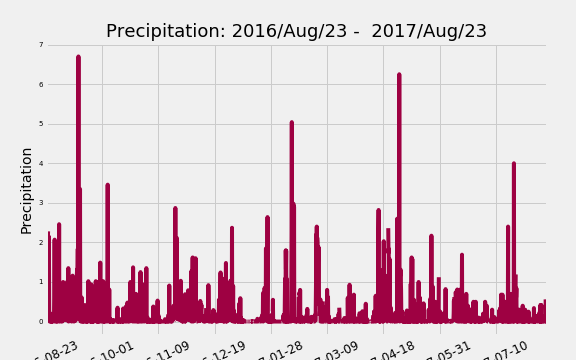

# Surfs Up! - SQLAlchemy ORM, Python, Matplotlib and Flask

This repositorie shows climate analysis and data exploration from two databases.
The data was loaded into the jupyter notebook using SQLAlchemy.

# The analysis will be from 2016-08-23 to 2017-08-23.

## Climate Analysis and Exploration

The station USC00519281 has the highest number of observations.
The minimum temperature at station USC00519281 is 54.0, the maximun is 85.0 and the average is 71.66378066378067.

* Choose a start date and end date for your trip. Make sure that your vacation range is approximately 3-15 days total.

* Use SQLAlchemy `create_engine` to connect to your sqlite database.

### Precipitation Analysis

### Station Analysis

The total number of stations are 9, and the analysis showed that USC00519281 - 

Honolulu, Hawaii had up to 7 inches of rain in last twelve months. Months with more than 3 inches of rain include: September, October, February, April, and July.
The most active station indicates the lowest temperature (54.0°F), highest temperature (85.0°F), and average (71.7°F) of the last twelve months.
The aggregate weather data helps us find the daily normals for the trip dates (07-01-2017 to 07-14-2017). The visualization labeled 'Aggregate Daily Normals for Trip Dates' shows the temperature extremes for the trip (low 60°F and high 88°F) while the average predicted temperatures stay in the mid 70's.

### Temperature Analysis

    

### Daily Rainfall Average.

  
  
  ## Step 2 - Climate App

